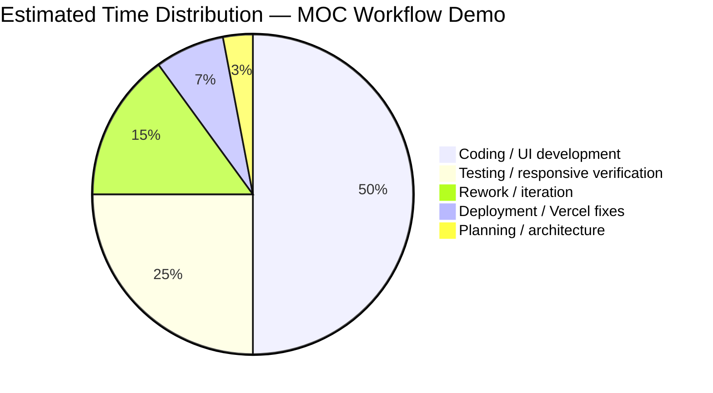
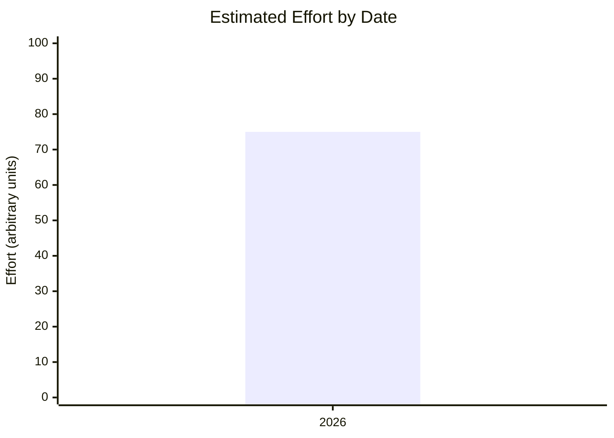
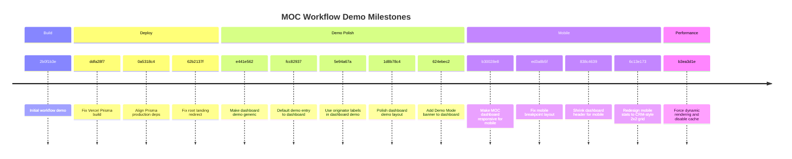

# MOC Workflow Demo — Project Summary

## Project Info
- Project name: MOC Workflow Demo
- Repository: https://github.com/roger64s/moc-workflow-demo.git
- Branch: main
- Session dates: 2026

## Scope Summary
Built a Management of Change (MOC) workflow dashboard demo. Later iterations added demo mode, responsive mobile layout, and Vercel deployment fixes.

Key files:
- Dashboard and workflow UI
- Prisma schema and database setup
- Vercel deployment configuration
- Separate interactive metrics page: [charts.html](charts.html)
- Vercel dashboard button opens the deployed Project Metrics page at `/charts.html`.
- Chart values display responsive, contrast-aware numeric labels.

## Time Distribution (estimated %)

## Estimated Effort by Date

## Commit Timeline

## Lessons Learned
- Prisma production dependencies need explicit alignment for Vercel builds.
- Demo mode and sample data make the dashboard easier to share without backend.
- Mobile breakpoints required multiple iterations to get the stat grid right.

## Final State
- Deployed via Vercel
- Supports demo mode, responsive layout, dynamic rendering
- Top dashboard actions include a Metrics button linking to `/charts.html`.

## Closeout — 2026-08-17
- Shortened the first-viewport Project Metrics action to a clear Metrics button.
- Verified the button opens the deployed `/charts.html` metrics page.
- Completed a successful Next.js production build and responsive local preview.
